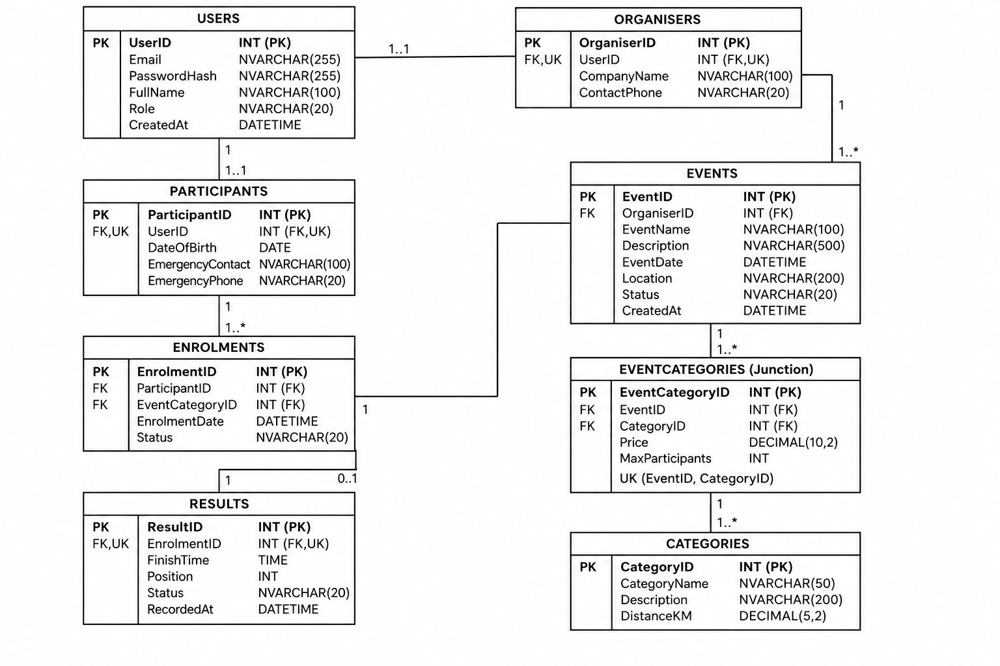

# RaceDay
## Programming 2B - PROG6212
RaceDay is a race event management system designed to allow organisers to manage running events, race categories, participant enrolments and race results.
The system supports two main roles:
- **Organiser**
- **Participant**
---
## Project Features
### Organiser
Organisers can:
- Register and log in
- Create events
- Update events
- Delete events
- Create and manage race categories
- Add categories to events
- Update event category details
- Remove categories from events
- View participant enrolments
- Manage enrolment statuses
- Capture race results
- Update race results
- View organiser dashboard information
### Participant
Participants can:
- Register and log in
- Update their profile
- View available events
- View race categories
- Enrol in events
- View their enrolment history
- Withdraw from an enrolment
- View their personal race results
- View participant dashboard information
---
# Database
The RaceDay database consists of the following tables:
- Users
- Organisers
- Participants
- Categories
- Events
- EventCategories
- Enrolments
- Results
The database uses primary keys, foreign keys, unique constraints and relationships to maintain data integrity.
---
# Entity Relationship Diagram (ERD)
The ERD illustrates the tables in the RaceDay database and the relationships between them.

---
# API Endpoint Plan
The complete API endpoint plan is available in:
**API-ENDPOINT-PLAN.md**
The API includes endpoints for:
- Authentication
- User profiles
- Events
- Categories
- Event categories
- Enrolments
- Results
- Dashboards
---
# Authentication Endpoints
### Register
```http
POST /api/auth/register

Registers a new Organiser or Participant account.

Login

POST /api/auth/login

Authenticates a user and returns an authorization token.

⸻

User Profile Endpoints

GET /api/users/profile
PUT /api/users/profile

These endpoints allow logged-in users to view and update their profile information.

⸻

Event Endpoints

GET /api/events
GET /api/events/{eventId}
POST /api/events
PUT /api/events/{eventId}
DELETE /api/events/{eventId}

These endpoints allow users to view events and allow organisers to create, update and delete events.

⸻

Category Endpoints

GET /api/categories
POST /api/categories
PUT /api/categories/{categoryId}
DELETE /api/categories/{categoryId}

These endpoints allow users to view race categories and organisers to manage them.

⸻

Event Category Endpoints

GET /api/events/{eventId}/categories
POST /api/events/{eventId}/categories
PUT /api/events/{eventId}/categories/{eventCategoryId}
DELETE /api/events/{eventId}/categories/{eventCategoryId}

These endpoints manage the categories associated with individual events.

⸻

Enrolment Endpoints

GET /api/enrolments
GET /api/enrolments/my
GET /api/enrolments/{enrolmentId}
POST /api/enrolments
PUT /api/enrolments/{enrolmentId}
DELETE /api/enrolments/{enrolmentId}

These endpoints allow participants to enrol in events and allow organisers to manage enrolments.

⸻

Results Endpoints

GET /api/events/{eventId}/results
GET /api/results/my
GET /api/enrolments/{enrolmentId}/result
POST /api/enrolments/{enrolmentId}/result
PUT /api/results/{resultId}

These endpoints allow race results to be viewed, captured and updated.

⸻

Additional System Endpoints

GET /api/events/{eventId}/enrolments
GET /api/events/{eventId}/summary
GET /api/dashboard/organiser
GET /api/dashboard/participant

These endpoints provide event enrolment information, event summaries and dashboard information.

⸻

Role-Based Access

Role	Access
Public	Register and Login
Logged-in User	View events, categories and own profile
Participant	Enrol in events, view own enrolments and results
Organiser	Manage events, categories, enrolments and results

⸻

Database Script

The SQL database script is provided in:

SQLQuery1.sql

The script contains:

* Table creation
* Primary keys
* Foreign keys
* Constraints
* Sample data
* Data verification queries
* Enrolment queries
* Result queries

⸻

Repository Files

RaceDay/
│
├── .github/
│   └── workflows/
│       └── ci.yml
│
├── API-ENDPOINT-PLAN.md
├── RaceDay_ERD.png.jpeg
├── README.md
└── SQLQuery1.sql

⸻

CI/CD

The project includes a GitHub Actions workflow located at:

.github/workflows/ci.yml

The workflow is used to automatically run checks when changes are pushed to the repository.

⸻

Technologies

* C#
* ASP.NET Core Web API
* SQL Server
* GitHub
* GitHub Actions

### One thing to remember
Because your current GitHub file is **`RaceDay_ERD.png.jpeg`**, I deliberately used:
```markdown


